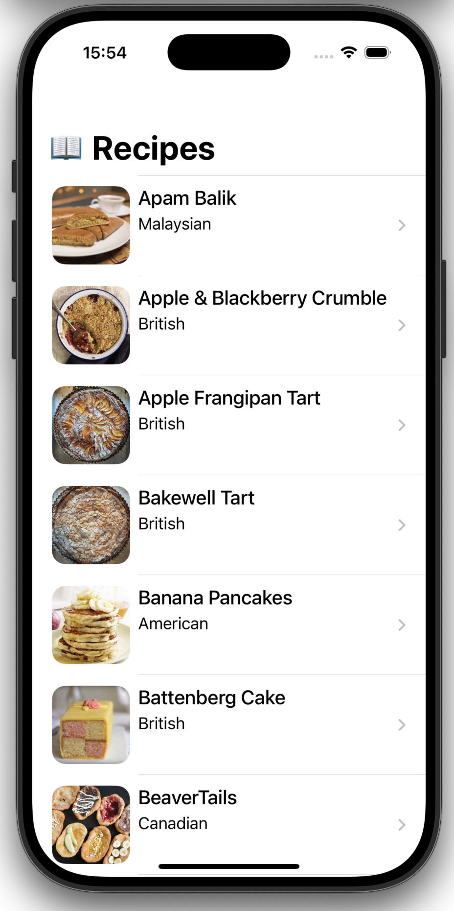
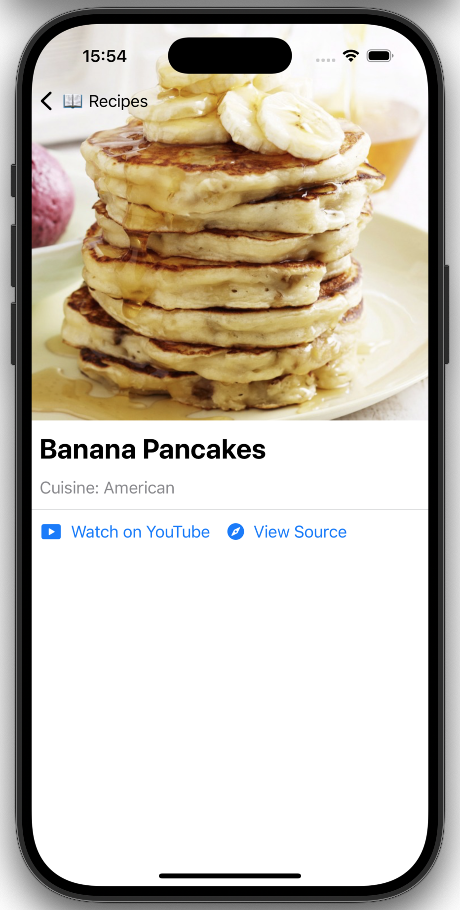
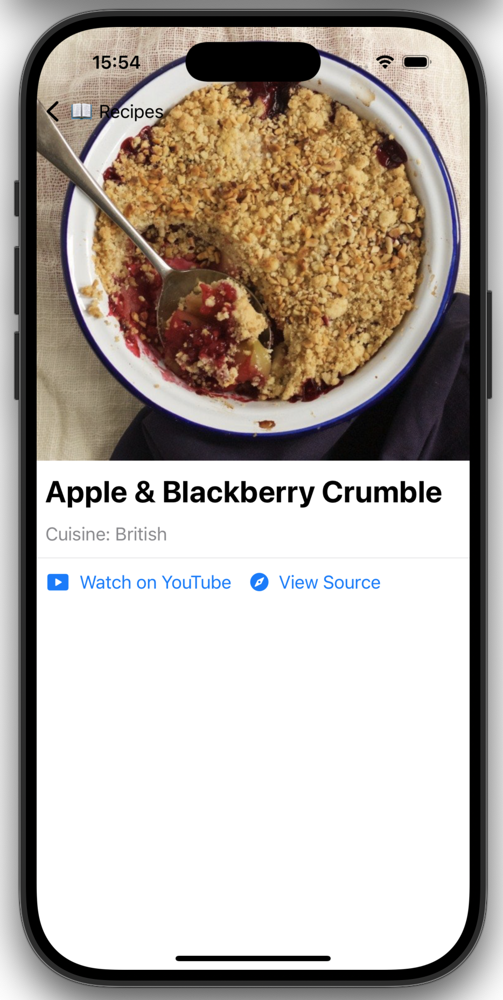

# Recipe App - Fetch Take Home Project

## Summary

This **Recipe App** is a SwiftUI-based application that fetches recipes from a provided API and displays them in an intuitive interface. Each recipe includes its name, photo, and cuisine type. Additionally, users can view more details about a recipe, including a larger image and links to the recipe’s source or YouTube video.

### Features:
- **List View**: Displays a list of recipes fetched from the API, showing basic information such as the recipe name, photo, and cuisine type.
- **Image Caching**: Images are loaded only when needed and cached to disk to avoid repeated network requests.
- **Recipe Detail Screen**: Users can view a larger image and open links to the recipe’s source or YouTube video in a web browser.
- **Pull to Refresh**: Users can refresh the recipe list at any time to get the latest data.
- **Asynchronous Image Loading**: All network operations and image loading are handled using **Swift Concurrency** (`async/await`) for efficient, modern asynchronous execution.

### Screenshots:

  
  
  

*Recipe list and detailed view screens showcasing recipe names, cuisines, photos, and links.*

---

## Focus Areas

### 1. Networking
Implemented a **generic, testable protocol-oriented networking layer** using **async/await** for all API calls.

### 2. Image Caching
Built a **custom image caching solution** using **NSCache** and **FileManager** for efficient image loading and reduced network requests.

### 3. UI/UX Design
Created the UI with **SwiftUI**, emphasizing a clean, user-friendly layout.

### 4. Testing
Implemented **unit tests** to verify networking functionality.

